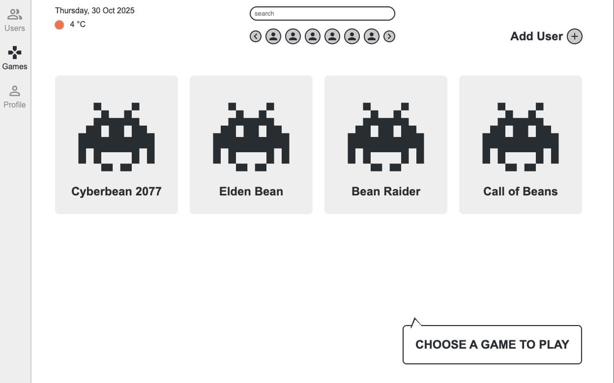
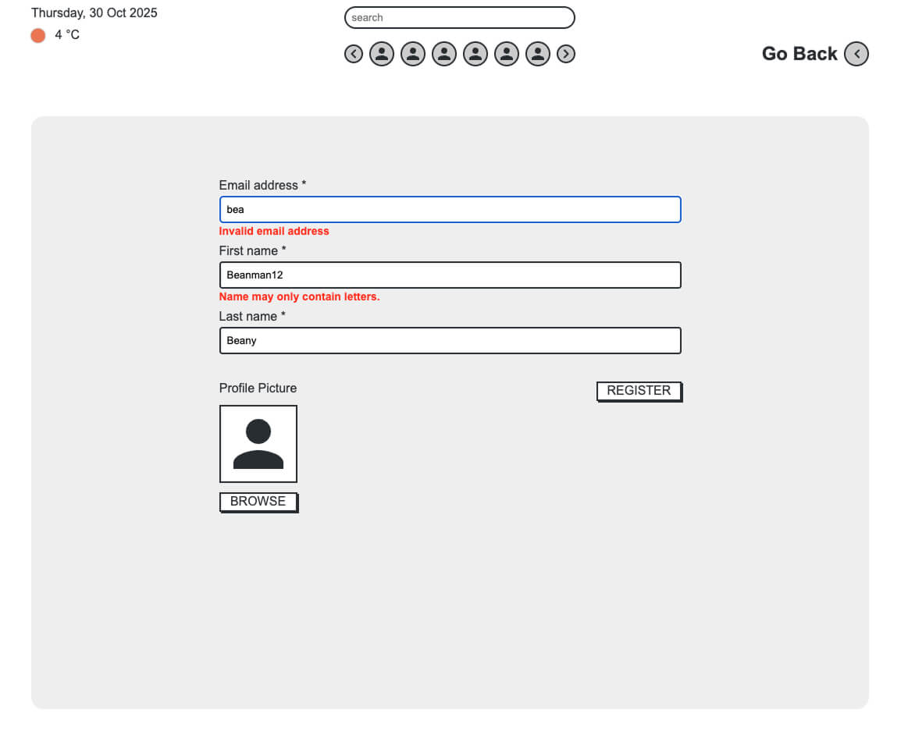

# 🎮 Gamedashboard

A full-stack game session tracking dashboard built with React and Express. Tracks your gaming sessions.

### Student:

_Magnus Nilsson_

---

<br>

## 🛠️ Tech Stacks:

### 🎨 Frontend:

-   React 18 - UI library
-   TypeScript - Type safety
-   Vite - Build tool and dev server
-   TanStack Query (React Query) - Server state management and caching
-   TanStack Form - Form state management
-   React Router - Client-side routing
-   Zustand - Global state management (active user, toast notifications)
-   Chart.js with react-chartjs-2 - Data visualization
-   Axios - HTTP client
-   Zod - Schema validation
-   CSS - Styling (no CSS frameworks)
-   Eslint - linting.

### 💾 Backend:

-   Node.js - Runtime environment
-   TypeScript - Type safety
-   Express 5 - Web framework
-   Prisma - ORM for PostgreSQL
-   PostgreSQL - Relational database
-   Zod - Request validation
-   CORS - Cross-origin resource sharing
-   tsx - TypeScript execution for development
-   dotenv - Environment variable management
-   Eslint - linting.

<br>

## 📦 Installation & Setup

### Prerequisites

-   **Node.js** (v18+)
-   **PostgreSQL** database
-   **npm** or **pnpm**

### Root Setup

Clone the repository:

```bash
git clone https://github.com/MagNilsInSchool/gameDashboard
cd gameDashboard
```

### Backend Setup

```bash
cd backend
npm install

# Configure environment variables
cp .env.example .env
# Edit .env with your DATABASE_URL and DEV_MODE setting

# Generate Prisma client
npx prisma generate

# Run database migrations
npx prisma migrate dev

# Seed the database with sample data
npx prisma db seed

# Start the backend server
npm run dev
```

<br>

> [!IMPORTANT]
> If DEV_MODE in .env is set to "true" then session times are multiplied by 60. Meaning seconds become minutes for testing purposes.

<br>

> [!NOTE]
> Backend runs on http://localhost:1338

<br>

### Frontend Setup

```bash
cd frontend
npm install

# Start the development server
npm run dev
```

<br>

> [!NOTE]
> Frontend runs on http://localhost:1337

<br>

## 📁 Project Structure

```
gameDashboard/
├── backend/
│   ├── handlers/           # Request handlers for routes
│   ├── interfaces/         # TypeScript interfaces
│   ├── prisma/            # Database schema and migrations
│   │   ├── schema.prisma
│   │   ├── seed.ts
│   │   └── migrations/
│   ├── routes/            # Express route definitions
│   ├── schemas/           # Zod validation schemas
│   ├── utils/             # Utility functions and response handlers
│   ├── .env.example       # Environment variables template
│   ├── server.ts          # Express server entry point
│   └── package.json
│
├── frontend/
│   ├── public/            # Static assets
│   ├── src/
│   │   ├── api/          # API handlers and queries
│   │   │   ├── handlers/     # Axios API calls
│   │   │   ├── mutations/    # TanStack Query mutations
│   │   │   ├── queries/      # TanStack Query queries
│   │   │   └── errorHandler/ # Error handling utilities
│   │   ├── components/   # React components
│   │   ├── interfaces/   # TypeScript interfaces
│   │   ├── pages/        # Page components
│   │   ├── routes/       # React Router setup
│   │   ├── schemas/      # Zod validation schemas
│   │   ├── stores/       # Zustand state management
│   │   ├── utils/        # Utility functions
│   │   ├── App.tsx       # Root component
│   │   └── main.tsx      # Application entry point
│   ├── index.html
│   ├── vite.config.ts
│   └── package.json
│
└── README.md

```

<br>

## ERD


<br>

## Routes:

_Data is cached with tanstack query._

### Landing page:

Clicking a user makes that user the active user and navigates you to their profile. Active user is stored in session storage. Trying to navigate to profile without having first made an active user will show you a toast message and stop you from navigating.

On landing page the searchbar in header filters userslist with a debounced search. Weather display is the same on all pages. If it fails to fetch it will show an error message. Clicking the message tries to refetch.

Profile carousel by searchbar is just cosmetic. It is not implemented.


### Games:

Lists the games in the db. Clicking a game without an active user will show a toast and navigate you back to landing page. If you have an active user you will go to playing page.

Searchbar in header will let you filter games with debounced search.



### Playing:

With a correct userId and gameId you will be able to start a gaming session. Pressing the start button will show a toast if call is succesfull and start a session. If DEV_MODE variable in backend .env is set to "true" every second will be registered as a minute on the backend. Pressing stop will cancel the session. Pressing the profile card will navigate you to respective profile.


### Profile:

Shows the total personal history of the users time spent in games presented in different ways.


Shows stats for 7 days back for all users combined.


### Registration

Form built in tanstack form and validation with zod. Image selector is not implemented so it's just cosmetic. DB rejection error shown as toast (say if you are trying to register an email that already exists.).

